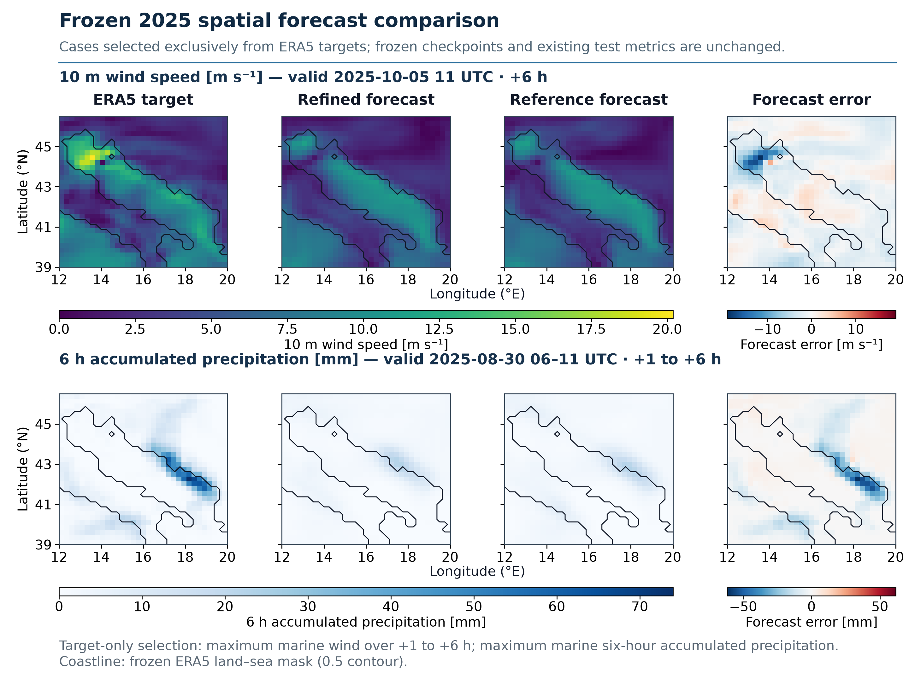

# StormEngine-DL

StormEngine-DL is a sparse-to-grid deep-learning system for short-range weather
forecasting over the Adriatic region. It converts the preceding 12 hours of
irregular and partially missing point observations into forecasts for lead
hours +1 to +6 on a fixed 31 x 33 atmospheric grid.

The project was developed as part of the MSc GeoInformatics course at
Politecnico di Milano. Its main contribution is not a new global forecasting
architecture, but a reproducible bridge between ERA5-supervised learning and
operational inference from heterogeneous DPC/MeteoHub and Open-Meteo inputs.

> **Research-use notice**
> StormEngine-DL is intended for controlled research evaluation and operational
> replay. It is not a public-warning system and must not be used as the sole
> source for safety-critical decisions.

## Forecast task

| Item | Final project contract |
|---|---|
| Domain | 39.0--46.5 degrees N, 12.0--20.0 degrees E |
| Grid | 0.25 degrees, 31 x 33 cells |
| History | 12 hourly steps |
| Forecast horizon | +1 to +6 hours |
| Input coordinates | 239 physical coastal stations + 151 marine-support points |
| Input variables | `msl`, `u10`, `v10`, `i10fg`, `t2m`, `tp` |
| Predicted fields | `msl`, `u10`, `v10`, `t2m`, `tp` |
| Input quality channels | value, per-variable validity mask, observation age and source type |

The 151 marine coordinates are **model-derived support points**, not physical
weather stations. During historical training their values are sampled from
ERA5; during operational replay they are supplied by Open-Meteo model output.

## Model architecture

```text
12 h sparse point sequence
        |
        v
mask-aware SetConv spatial encoder
        |
        v
ConvGRU temporal processor
        |
        v
CNN field decoder
        |
        v
+1 ... +6 h gridded forecasts [5, 31, 33]
```

- The **SetConv encoder** maps an unordered set of irregular observations to a
  regular latent grid.
- The **ConvGRU processor** evolves the latent atmospheric state through the
  six forecast lead times.
- The **CNN decoder** maps each future latent state to the five physical target
  fields.

## Data sources and roles

| Source | Role in StormEngine-DL |
|---|---|
| ERA5 | Historical point inputs and complete gridded training targets |
| ERA5T | Recent gridded proxy reference for operational evaluation |
| DPC/MeteoHub | Physical coastal-station observations used at inference time |
| Open-Meteo | Model-derived support at the 151 marine coordinates |

ERA5 provides a controlled training environment because point inputs and dense
future targets are derived from the same atmospheric state. Operational inputs
are more difficult: variables can be missing, delayed or semantically
incompatible. The final tensor contract therefore preserves masks and
observation ages, and DPC station pressure is reduced to mean sea level before
it is used as `msl`.

The final production refit uses all ERA5 years from 2010 through 2025. Because
all 16 years participate in that refit, none of them is subsequently presented
as an independent test of the production checkpoint. The frozen production
model is evaluated using 2026 ERA5T targets.

## Main findings

- The first controlled end-to-end system established positive skill relative
  to the input-compatible sparse persistence baseline.
- Adding marine spatial support reduced validation loss by 11.5% and improved
  offshore wind, temperature and precipitation performance. This ablation
  establishes the value of marine spatial support; it does not treat
  Open-Meteo as physical marine truth.
- Isolated Encoder, Processor and Decoder improvements did not automatically
  produce a better integrated forecast model. Controlled end-to-end refinement
  was therefore required.
- The accepted continuous-field refinement achieved +2.53% mean sea skill on
  the 2024 confirmation period and +3.01% on the one-time 2025 test, with all
  12 sea-wind component/lead comparisons improved.
- Aligning DPC station pressure to mean sea-level pressure improved MSL skill
  by approximately 58% in both the 2018 validation and 2019 one-time test.
- Event-aware training increased storm-any forecast-case CSI from 0.352 to
  0.496 and POD from 0.363 to 0.554, while FAR increased from 0.083 to 0.173.
  Continuous sea-domain RMSE worsened by approximately 0.8--2.6%, so the
  event-aware and continuous-field checkpoints represent different operating
  points rather than a universal replacement hierarchy.
- The final real-input evaluation completed all 152 forecast windows from
  1--8 August 2026 with finite outputs. Ordinary-field skill was mixed and
  variable-dependent. The week contained no events crossing the frozen event
  thresholds, so it does not validate operational event-detection accuracy.



## Repository layout

```text
configs/                 versioned experiment and production configurations
data/                    station registry, manifests and lightweight metadata
docs/                    workflow documentation, model cards and diagrams
notebooks/               interactive training and evaluation workflows
results/                 Git-tracked metrics, summaries and report figures
scripts/                 preprocessing, training, evaluation and prediction tools
src/stormengine_dl/      reusable data and model implementation
tests/                   contract, shape, causality and smoke tests
```

Large raw data, memory-mapped caches, checkpoints and bulk predictions are not
distributed through Git. They must be downloaded from the original providers
or generated locally using the documented workflows.

## Installation

Python 3.11 or later is required. From the repository root:

```bash
python -m venv .venv
```

Activate the environment using the command appropriate for the operating
system, then install the project:

```bash
python -m pip install --upgrade pip
python -m pip install -e ".[notebook,static]"
```

The core dependencies are PyTorch, NumPy, xarray, netCDF4, PyYAML and Shapely.
Cartopy and JupyterLab are provided through optional dependency groups.

CUDA is strongly recommended for training and full evaluation. The reported
experiments were executed on Windows with an NVIDIA RTX 4060 Laptop GPU. CPU
execution is suitable for lightweight inspection, preprocessing and bounded
smoke tests.

## Verify the installation

Run the test suite before using external data or checkpoints:

```bash
python -m unittest discover -s tests -v
```

Pipeline smoke tests only verify shapes, finite values, forward/backward
execution and output writing. They are not scientific performance results.

## Required external assets

A complete operational forecast requires the following assets outside Git:

1. ERA5 or ERA5T NetCDF files on the fixed Adriatic grid;
2. processed DPC/MeteoHub physical-observation tensors;
3. processed Open-Meteo marine-support tensors;
4. train-only normalization statistics and static spatial fields;
5. a checkpoint compatible with the selected configuration.

The default final checkpoint location is:

```text
artifacts/v9_2_event_aware_final16/seed_42/final.pt
```

The frozen checkpoint SHA-256 is recorded in the
[`final production model card`](docs/V9_2_FINAL16_MODEL_CARD.md). Checkpoints are
not included in ordinary Git history.

## Operational prediction

Target-free prediction uses four aligned input tensors: physical observations,
corrected physical MSL, marine-support variables and marine MSL.

```bash
python -u scripts/predict_v9_2_final16.py \
  --config configs/v9_2_event_aware_final16.yaml \
  --dpc-input data_external/meteohub/processed/official_hourly_physical.npz \
  --dpc-msl data_external/meteohub/processed/official_hourly_physical_msl.npz \
  --marine-input data_external/open_meteo/processed/icon2i_hourly_marine.npz \
  --marine-msl data_external/open_meteo/processed/icon2i_hourly_marine_pressure.npz \
  --checkpoint artifacts/v9_2_event_aware_final16/seed_42/final.pt \
  --output outputs/forecast.npz \
  --device cuda
```

The predictor writes a compressed forecast NPZ and a JSON provenance record.
It refuses to overwrite an existing forecast unless `--overwrite` is supplied.
Hourly precipitation is clipped only at its physical lower bound of zero; the
other predicted fields are not silently clipped.

## Reproducibility and interpretation boundaries

- Chronological partitions are used throughout development, confirmation and
  testing.
- Normalization statistics are fitted only on the corresponding training
  period and applied unchanged to later periods.
- Dense persistence uses a complete latest grid and is intentionally
  information-advantaged. Sparse persistence uses only model-facing point
  inputs and is the fairer deployment-compatible baseline.
- ERA5T is a common gridded proxy reference, not station-level observational
  truth.
- Numerical stability during a target-free stress test is evidence of software
  robustness, not forecast accuracy.
- Open-Meteo inputs are external numerical-model output, not measurements from
  an in-situ marine network.
- The final six-hour system does not implement a 48-hour forecast horizon.

## Key documentation and results

- [Final production model card](docs/V9_2_FINAL16_MODEL_CARD.md)
- [Operational tensor and system workflow](docs/V7_B_WORKFLOW.md)
- [Staged model-development workflow](docs/V8_WORKFLOW.md)
- [Pressure experiment](docs/V9_1_PRESSURE_EXPERIMENT.md)
- [Event-aware development plan](docs/V9_2_EVENT_AWARE_PLAN.md)
- [Original six-hour physical-event evaluation](docs/ORIGINAL_PHYSICAL_EVENT_EVALUATION.md)
- [2025 one-time final test](results/v9_2025_final_test/README.md)
- [Final 16-year production refit](results/v9_2_final16/README.md)
- [2026 real-input ERA5T evaluation](results/v9_2_final16_operational_era5t_20260801_20260808/README.md)

## Project links

- **Main repository:** <https://github.com/yiyilv/StormEngine-DL>
- **Early collaborative repository:** <https://github.com/galluzzodavide/StormEngine>
- **Shared project workspace:**
  <https://drive.google.com/drive/folders/10m3UanSMsKWUEqPCfgRNqTih99-e_941?usp=drive_link>

The main repository is the authoritative source for the final implementation
and reported evidence. The second repository and shared Drive folder preserve
selected early collaborative work and supporting files.

## External data portals

- [Copernicus Climate Data Store: ERA5 hourly data on single levels](https://cds.climate.copernicus.eu/datasets/reanalysis-era5-single-levels)
- [ItaliaMeteo MeteoHub data portal](https://meteohub.agenziaitaliameteo.it/app/datasets)
- [Open-Meteo Forecast API](https://open-meteo.com/en/docs)
- [Open-Meteo Historical Forecast API](https://open-meteo.com/en/docs/historical-forecast-api)
