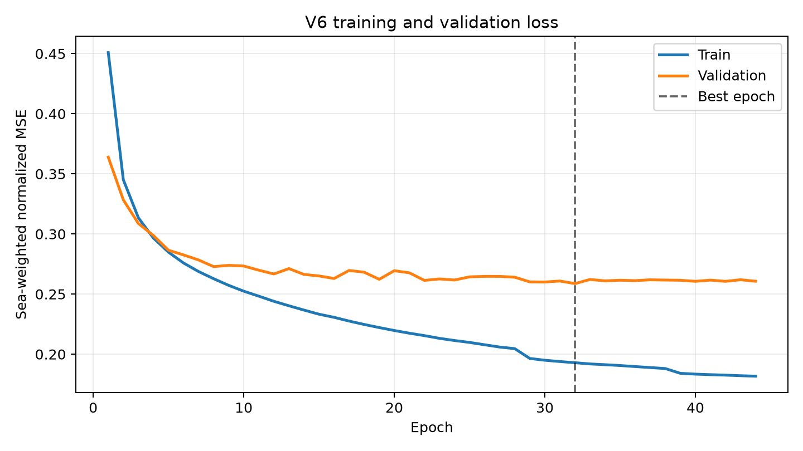
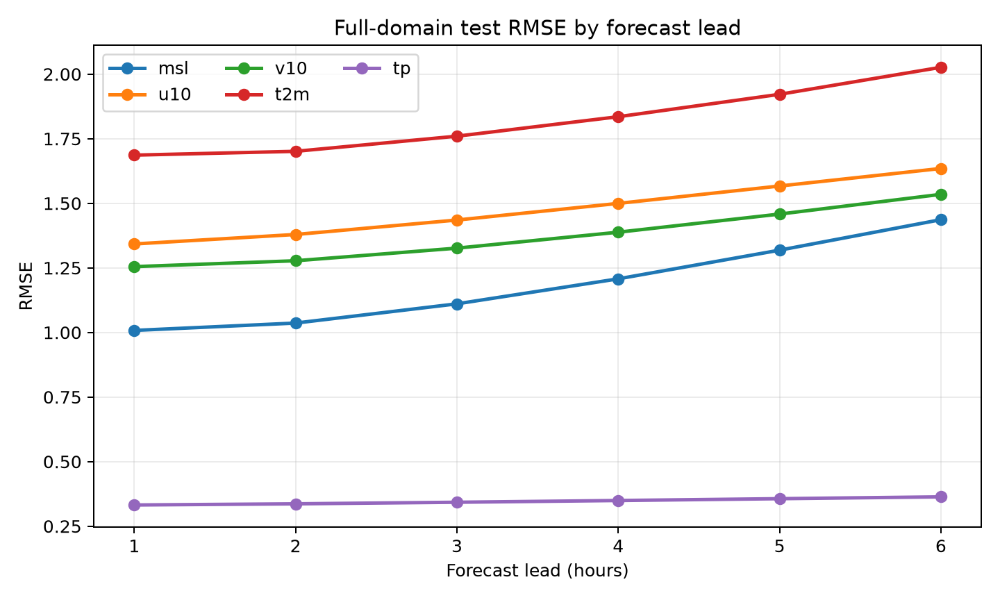
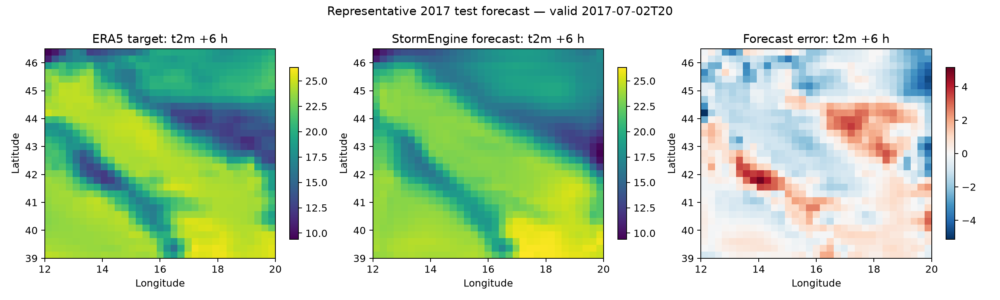

# StormEngine V6 2010–2017 baseline

This directory is the lightweight, reviewable record of the frozen V6 experiment. The model checkpoint, training cache, ERA5 NetCDF files, and bulk prediction arrays remain local and are intentionally excluded from Git.

## Reproducibility

- Code commit used for the frozen evaluation: `3e1670c`
- Configuration: `configs/era5_2010_2017.yaml`
- Domain: Adriatic, 39.0–46.5°N and 12.0–20.0°E on a 31 × 33 grid
- Station profile: `dpc_plus_sea` (390 enabled coordinates)
- Inputs: 12 hourly steps of `msl`, `u10`, `v10`, `i10fg`, and `t2m`
- Forecast targets: hours +1 to +6 for `msl`, `u10`, `v10`, `t2m`, and `tp`
- Training years: 2010–2015
- Validation year: 2016
- Test year: 2017
- Test samples: 8,743
- Best epoch: 32
- Best validation loss: 0.258697

The frozen checkpoint is retained locally at `artifacts/v6_2010_2017/best.pt`; it is not committed to GitHub.

## Aggregate 2017 test metrics

| Variable | Full MAE | Full RMSE | Land MAE | Land RMSE | Sea MAE | Sea RMSE |
|---|---:|---:|---:|---:|---:|---:|
| msl | 0.8598 | 1.1960 | 0.9502 | 1.3059 | 0.7401 | 1.0326 |
| u10 | 1.0148 | 1.4798 | 0.7962 | 1.0797 | 1.3045 | 1.8833 |
| v10 | 0.9588 | 1.3767 | 0.7861 | 1.0822 | 1.1876 | 1.6897 |
| t2m | 1.3245 | 1.8258 | 1.6823 | 2.2189 | 0.8503 | 1.1074 |
| tp | 0.1099 | 0.3469 | 0.1219 | 0.3667 | 0.0940 | 0.3190 |

Metrics are reported in the physical units produced by the evaluation pipeline. Detailed values for each forecast lead are in `metrics_by_lead.json`.

## Figures

### Training and validation

### RMSE by forecast lead

### Representative spatial forecast

The example is the middle saved 2017 test sample, showing 2 m temperature at +6 hours with a shared target/forecast color scale and a centered error scale.

## Files intentionally excluded

- `best.pt` and `last.pt`
- `cache/` and training caches
- ERA5 `*.nc` data
- Bulk prediction `*.npz` examples
- Executed Notebook outputs
