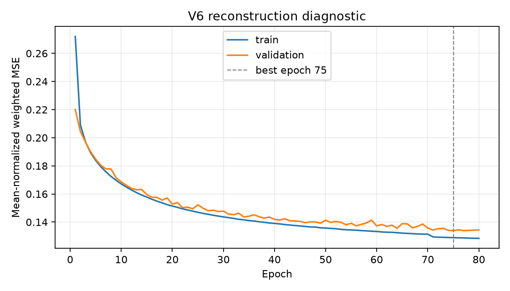

# V6 spatial reconstruction diagnostic

This result isolates the SetConv encoder and CNN decoder by removing the
ConvGRU temporal processor. It reconstructs the simultaneous ERA5 grid from
the 390 sparse coordinates and therefore diagnoses spatial reconstruction,
not future forecast skill.

- branch baseline: `component-diagnostics`;
- implementation commit: `6e3bc8a`;
- train years: 2010--2015;
- validation year: 2016;
- station profile: 239 physical plus 151 virtual sea coordinates;
- targets: `msl`, `u10`, `v10`, `t2m`;
- completed epochs: 80;
- best epoch: 75;
- best validation loss: 0.1338813994.

The exact training history and validation metrics are versioned here. The
binary checkpoint remains local at `artifacts/v6_reconstruction/best.pt`; its
size and SHA-256 are recorded in
`data/manifests/external_artifacts_20260810.json`.

The validation results indicate that marine wind reconstruction remains the
largest spatial weakness: sea RMSE is 1.8204 for `u10` and 1.4138 for `v10`.
Do not compare these values directly with the frozen V6 2017 forecast test:
this diagnostic uses 2016 validation data and reconstructs the current field.
